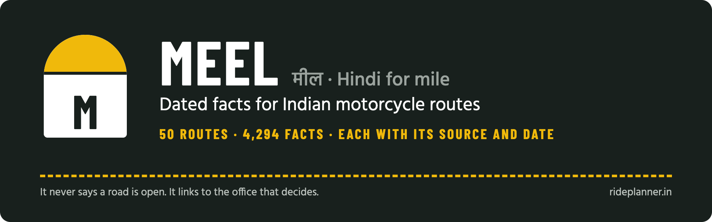
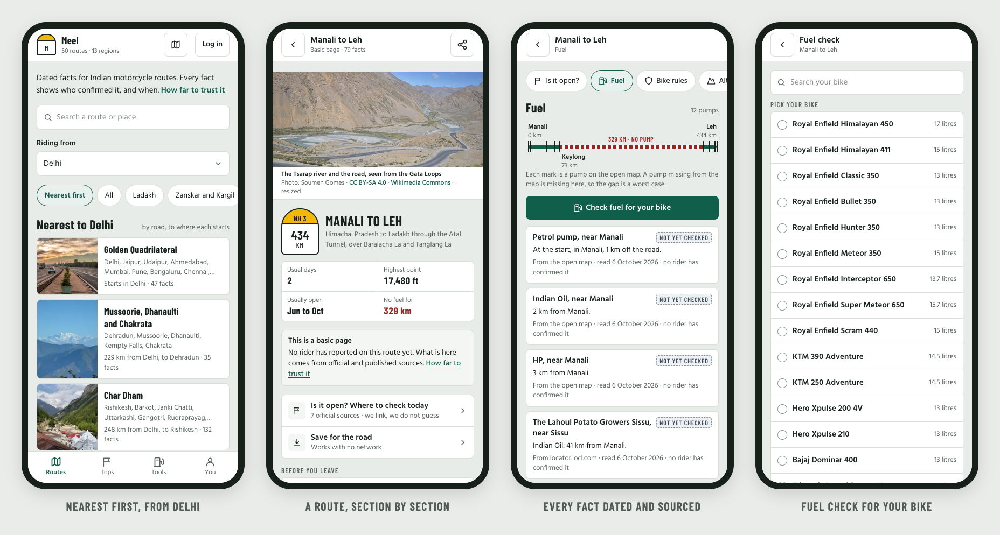
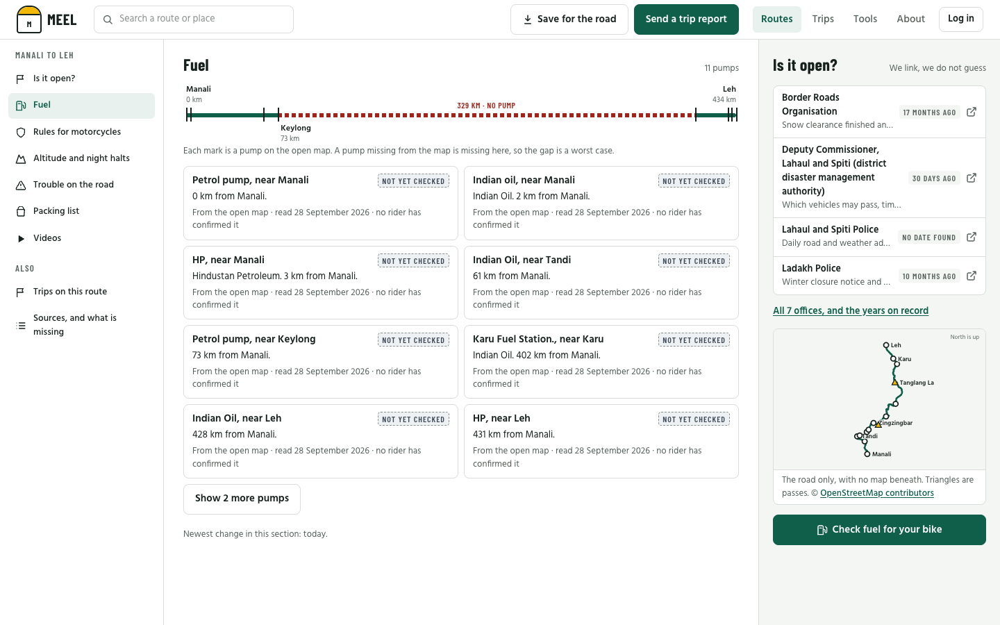
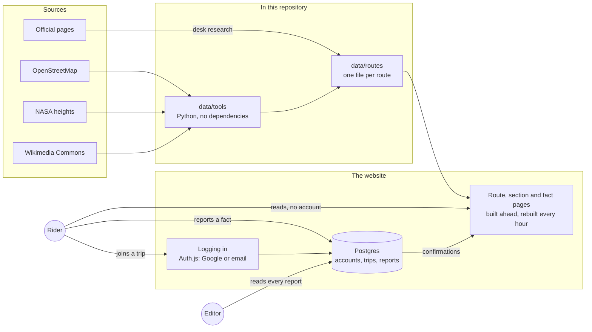

<div align="center">



<br>

**Fuel gaps, permits, passes and night halts for 50 Indian motorcycle routes.<br>Every fact shows where it came from, and the day it was last confirmed.**

<br>

[](https://nextjs.org)
[](https://react.dev)
[](https://www.typescriptlang.org)
[](https://tailwindcss.com)
[](https://www.prisma.io)
[](https://authjs.dev)
[](https://vercel.com)
<br>
[](#how-far-to-trust-it)
[](#the-rules-it-keeps)
[](#licence)

[What it does](#what-it-does) · [How far to trust it](#how-far-to-trust-it) · [How it works](#how-it-works) · [Run it yourself](#run-it-on-your-machine) · [The wireframes](design)

</div>

<br>

<p align="center">
  
</p>

## Why Meel

Every riding season, the same questions come up in every riders' chat group. Does the pump at Tandi have fuel? Has Baralacha La opened to motorcycles yet? Do I need a permit for this road? How long should I rest before Khardung La?

Someone answers from memory. The answer scrolls away, and next year the question is asked again. Worse, the answer is often out of date. Advice about Rohtang Pass still circulates years after the Atal Tunnel opened in October 2020 and made it unnecessary for the Manali to Leh road.

Meel is the memory those groups don't have. It keeps **one page per route**, split into sections: fuel, permits and rules, whether a pass is open, altitude, mechanics, network and where to stay. **Every fact carries its source and a date.** A fact that has not been checked for a while says so, in plain words, before anyone relies on it.

*Meel* (मील) is Hindi for *mile*, as in the kilometre stones beside every Indian road. The stone is the logo.

## What it does

| | |
|---|---|
| **50 routes, section by section** | From Manali to Leh and the Spiti circuit to the Konkan coast and the North-East: 13 regions and about 33,600 km of road. The highest point on any route is Umling La, at 5,799 m. |
| **Every fact dated and sourced** | 3,846 facts, each with its source, the day it was read, and a state: fresh, ageing, stale, not yet checked, or riders disagree. |
| **Fuel check** | Pick your bike, and the route says where your tank runs short and how much extra to carry. |
| **Altitude check** | Choose where you will sleep, and the route warns you if a night climbs too fast for your body to cope. |
| **Packing list** | What to carry for that route in that month. |
| **"Is it open?" without guessing** | Meel never says a road is open. It links to the office that decides, and to where that office announces it. |
| **Reports with no account** | Anyone can say "still true" or "this has changed". The editor reads every report before it changes a fact. |
| **Trips board** | Post a trip, ask to join one, and the leader decides. The chat group link is shown only to riders the leader has accepted. |
| **Share a single fact** | Every fact has its own address and preview card, so the answer to a chat group's question is one link, with its date written on it. |
| **Save for the road** | Keep a route on your phone for the stretches with no network. A report made offline is sent when the signal returns. |

<p align="center">
  
</p>

## The rules it keeps

- **It never says a road is open.** One person cannot keep daily road status true, so Meel links to the office that decides.
- **Every fact has a date, and a source.** Nothing shows as confirmed until a rider or the editor has confirmed it.
- **Every "today" is India's calendar day**, on the server and on the phone.
- **Reading, and reporting a fact, never need an account.** Joining or posting a trip does, because a leader needs to know who is asking.
- **Credit is given where it is due.** The map data, the heights and every picture are credited on the page that uses them.
- **Kept by one person, as a hobby.** No advertising and no paid listings. If that ever changes, every paid link will be marked as such.

## How far to trust it

> [!IMPORTANT]
> **Meel is early.** Every fact was gathered at a desk, from official and published sources, in September 2026. **No rider has confirmed any of it yet**, which is why the screens above say "not yet checked". Riders' reports are what will turn these pages into something to rely on. Until then, treat each fact as a lead to check, and look at its date.

The site is not public yet. It runs privately while the facts are checked, and will open at **rideplanner.in**.

## How it works



Routes and facts live in files, in `data/`, so every change to a fact is a change you can read in git. Pages are built ahead and rebuilt every hour, so they load fast on a weak signal. Only what riders create lives in the database: accounts, trips, requests to join, and reports.

| Part | What it uses |
|---|---|
| Website | [Next.js 16](https://nextjs.org) with the App Router, [React 19](https://react.dev), [Tailwind CSS 4](https://tailwindcss.com), TypeScript in strict mode |
| Database | Postgres through [Prisma 7](https://www.prisma.io). Live: [Neon](https://neon.tech) in Singapore, beside the site's functions |
| Logging in | [Auth.js](https://authjs.dev): Google, or an email and a password scrambled with scrypt |
| Data tools | Python, standard library only, in `data/tools/` |
| Hosting | [Vercel](https://vercel.com). Every push to `main` deploys, and database migrations run on each live build |
| Offline | A service worker keeps a saved route. Reports made offline wait on the phone |

## Run it on your machine

You need Node.js 22.13 or newer, pnpm 9, and Postgres 14 or newer. On a Mac, Homebrew's `postgresql@16` is what this was built against.

```bash
git clone https://github.com/vishalmeena2211/meel.git && cd meel/web
```

```bash
pnpm install
```

```bash
createdb meel && pnpm db:migrate
```

```bash
echo "AUTH_SECRET=$(openssl rand -base64 32)" >> .env.local
```

```bash
pnpm dev
```

Then open http://localhost:3000. Every setting, how to add Google login, and how to make yourself the editor are in [`web/README.md`](web/README.md).

## Repository layout

| Folder | What is in it |
|---|---|
| [`web/`](web) | The website |
| [`data/`](data) | Everything the site shows, for fifty routes, with the source of every fact. See [`data/README.md`](data/README.md) |
| [`design/`](design) | The wireframes: one frame for each situation a rider can be in, with build notes under each. Open `meel-wireframes.html` in a browser |
| [`docs/`](docs) | The plan, the research behind it, and a frame-by-frame check that the site matches the drawings |

New here? Start with [`docs/morning-report-2026-09-28.md`](docs/morning-report-2026-09-28.md), which says what exists and how far to trust it. Then read [`docs/plan.md`](docs/plan.md).

## Roadmap

- [x] Fifty routes, with every fact dated and sourced
- [x] Fuel, altitude and packing checks
- [x] Fact reports and trip reports, and the editor's desk
- [x] Trips board, with accounts through Google or email
- [x] Saving a route for no network
- [ ] Riders confirming the facts: the step that matters most
- [ ] Opening at rideplanner.in, with a privacy notice
- [ ] Password reset by email
- [ ] Logging in with a phone number
- [ ] Automatic tests

## Contributing

**If you ride:** the most useful thing you can do is check a fact on a road you know, and say whether it is still true. That needs no account. When the site opens, every fact will have a button for it.

**If you write code:** read [`web/README.md`](web/README.md) first. A change to a screen starts in the wireframes, in [`design/`](design), before it is built. Keep the words plain: the site talks to riders, not to developers.

## Credits

Meel stands on other people's work, and names it:

- **Map data** © [OpenStreetMap contributors](https://www.openstreetmap.org/copyright), available under the Open Database Licence.
- **Heights** from NASA's Shuttle Radar Topography Mission, served by [Open Topo Data](https://www.opentopodata.org).
- **Pictures** from [Wikimedia Commons](https://commons.wikimedia.org), each credited beside it, with its author and licence.
- **Fonts:** [Barlow Condensed](https://fonts.google.com/specimen/Barlow+Condensed) and [Hind](https://fonts.google.com/specimen/Hind), under the SIL Open Font Licence.

The full list, source by source, is on the site's credits page, and in [`data/README.md`](data/README.md).

## Licence

**The code is under the [MIT licence](LICENSE).** Use it, change it and share it, keeping the copyright notice.

**The data is not.** It keeps the licences of its sources, which cannot be changed here: map data under the Open Database Licence, heights in the public domain, and each picture under the licence named beside it. See [`data/LICENSE.md`](data/LICENSE.md).

## Words used here

| Word | What it means |
|---|---|
| **Fact** | One thing a rider needs to know, such as a pump, a permit or a pass, with its source and a date |
| **State** | How far to trust a fact today: fresh, ageing, stale, not yet checked, or riders disagree |
| **Basic page** | A route whose facts come from desk research. A **full page** also has riders' reports |
| **Section** | One part of a route page, such as fuel or rules, each on its own screen |
| **Editor** | The person who keeps Meel, reads reports, and approves a rider's first trip |

<br>

<div align="center">
<sub>Made in India, for riders. Meel never says a road is open.</sub>
</div>
